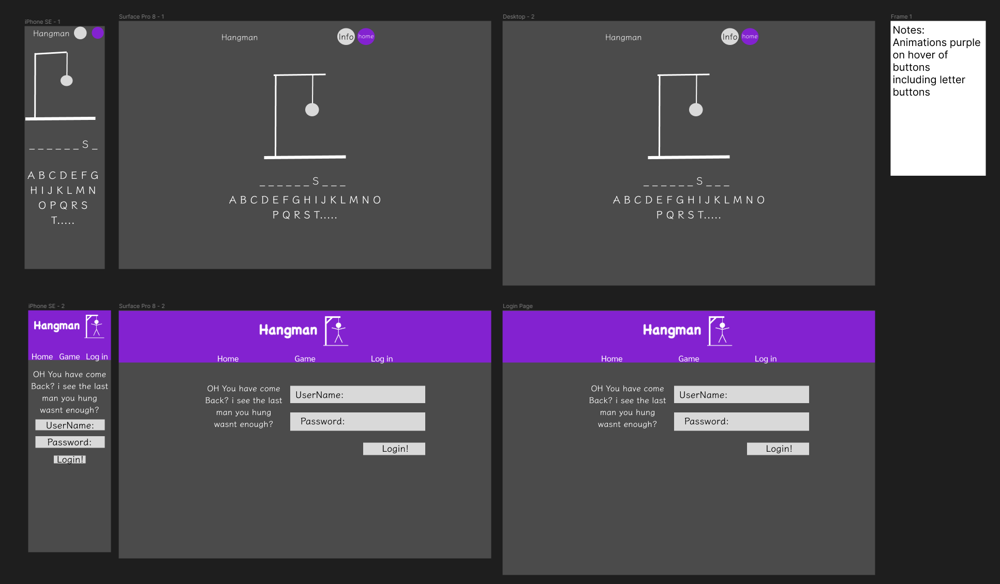
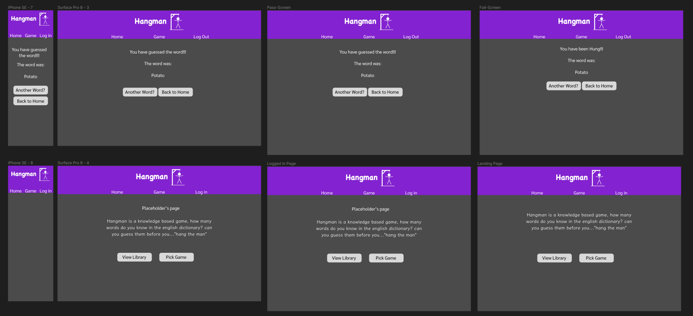
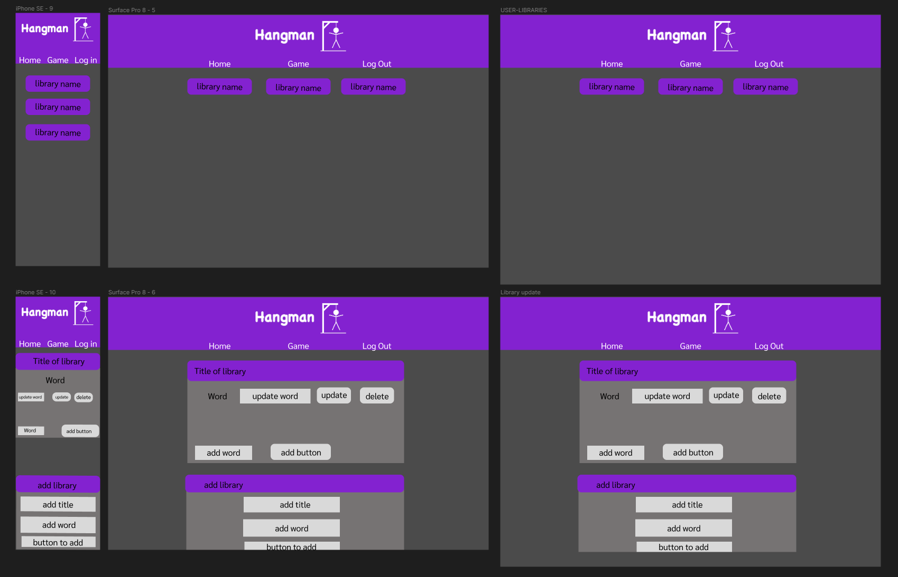
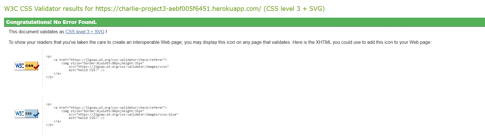
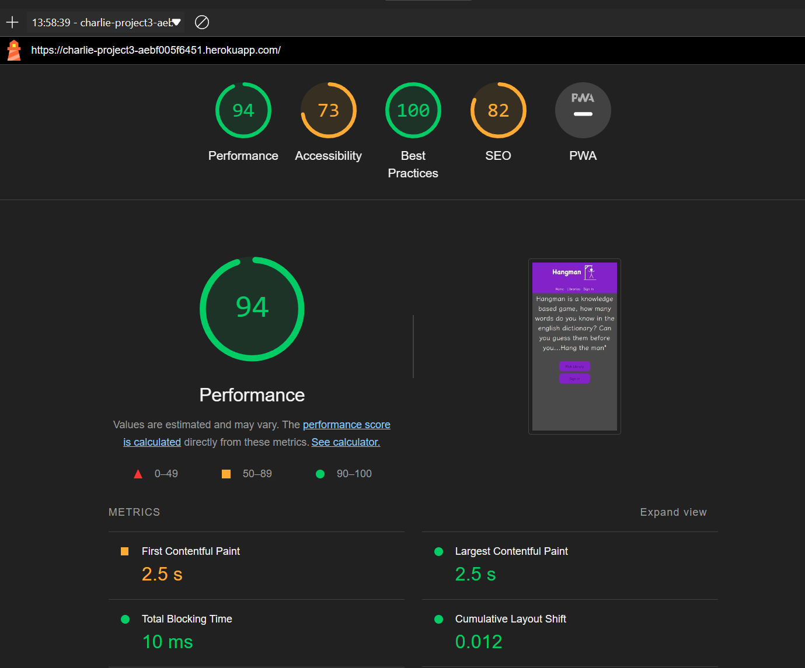
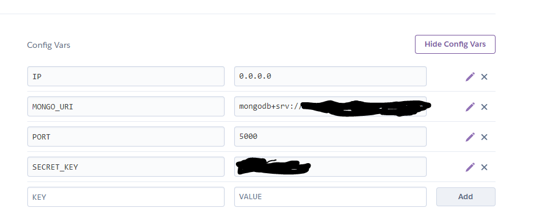
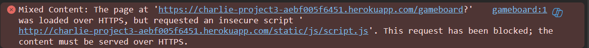

# Hangman

## Back-end development

---
an advanced hangman game which you can create your own libraries on which the game will select a random word in order for you to guess 

Live Site

## Table of content

- [UX](#ux)
  - [User stories](#user-stories)
    - [New User Goals](#new-user-goals)
    - [Returning User Goals](#returning-user-goals)
  - [Project Goals](#project-goals)
  - [Business Goals](#business-goals)
  - [Minimum Acceptance Criteria](#minimum-acceptance-criteria)
- [Development](#development)
  - [Inital Idea](#inital-idea)
  - [Final Idea](#final-idea)
    - [Notable Design Decisions](#notable-design-decisions)
  - [Testing](#testing)
    - [Pre code Testing](#pre-code-testing)
    - [During Code Testing](#during-code-testing)
    - [Final Testing](#final-testing)
      - [User Comments](#user-comments)
      - [Personal Testing](#personal-testing)
  - [Features implemented](#features-implemented)
    - [Nav Bar](#nav-bar)
    - [Sign In](#sign-in)
    - [Sign Up](#sign-up)
    - [Edit Libraries](#edit-libraries)
    - [The Gameboard](#the-gameboard)
  - [Planned Features](#planned-features)
  - [Technologies Used](#technologies-used)
  - [Issues](#issues)
    - [Known Bugs](#known-bugs)
    - [Fixed Bugs](#fixed-bugs)
  - [Deployment](#deployment)
    - [Process](#process)
    - [Enccounted Issues](#encounted-issues)
- [Credits](#credits)

## UX

---

### User Stories

#### New User Goals
- I would like a simple selection process where i can try the game without having to login
- i would like a clear way of navigating around the website

#### Returning User Goals
- i would like to be able to login and use that for ceritan functions.

### Project Goals
- to create an engaging game that entices people to keep playing and learn while they do so.

### Business Goals
- create a high traffic game that will bring new and olds users back 

### Minimum Acceptance Criteria
- fully functioning hangman game
- a database of which words will generate from

## Development

---

### Inital idea
the inital idea was simple, to create a basic hangman game where the game would select random words, i learned quickly that this would not be enough

### Final Idea
my final idea incoperates login functions so that each user can create their own libraries and update words within them.

i decided to go for a simple retro look, as hangman is a very old game i took insperation from the old 2d text games. and tried to keep with tradition. i thought the font "Klee One" was perfect for this, i felt the font brought the rather sharp lines of the rest of the site together.

as this design was more of a retro look, i tried to be minimalist while trying to bring the website to the 21s centruy.

#### Notable Design Decisions.

## Testing

---

### Pre code Testing
i used figma to help test potential designs, this took a lot of time as i couldnt get the idea correct.

### During Code Testing
i often used print to show variables that i struggled getting to pass in and out of functions some notable:
- the word being pulled from the database was not being displayed correctly
- i had trouble with the "edit" route, print allowed me to debug where the code was going wrong, the issue ended up being a typo within the route.

### Final Testing
testing was done across a few small devices
- samsung s21
- samsung s24 ultra
- samsung s24
- iphone 5
after some tweaks mentioned below, it appears to be functioning as intended.

I ran the code through css validator and got a pass result 

Lighthouse returned 96 points, which i am happy with 

#### User Comments
- some button text has different sizes (fixed with removing some classes)
- reset button takes away from the login button (i agreed and removed it from login)
#### Personal Testing
I went trough all links to make sure they are working,  checked the phone sizing and the website needed alot of tweaking.
- updating Libraries was out of line, including the add word at the bottom.
- view libraries wasnt shrinking over smaller devices. updated to make this work.

## Features Implemented

### Nav Bar
the nav bar is a very simple design incoperating a Logo, the logo is clickable to take you back to the home page(or logged in page if you are logged in)

### Sign In
the sign in page is used for reoccuring users, so they can create and edit their won libraries to use within the game

### Sign Up
the sign up page is for if people want to make their own libraries for the game 

### Edit Libraries
edit libraries allows you you edit the database for all CRUD functions. you can view and update words, or create new libraries entirely. but only your ones, you do not have access to ther users libraries

### The Gameboard
the gameboard is simple is design, i wanted to make it minimalist so it would be simple and easy to use. there is an array of buttons that disapear when you click them. putting your guess through the app. and revealing a letter if it was a correct guess

## Planned Features
- create more templates using different launguages, so that a wider base of users can access the website.
- following the above, also allow more educational use, being able to use the website as a trainer for learning other launguages 

## Technologies Used

- HTML 5
- CSS 3
- JAVASCRIPT
- Bootstrap v5
- Font awesome
- Google fonts
- Github
- gitpod
- Figma for design
- Flask
- Python3
- MongoDB

## Issues

### Known Bugs

- the accordions start closed, but the header wuld indicate they are open, with the off purple and arrow in wrong direction
- the gameboard briefly refreshes after each button press. it is not seamless. this is because i had to put a delay on the page, the delay is used to give the guess time to be sent through the app before the page is rendered. i did not find another way to do this.
- the font i have used refuses to be bold, this has caused some discomfort as i would of liked to make the nav items bold so they could be read easier.

### fixed Bugs
- the "word was" at the end of the game was not pulling the word through, i forgot to remove the place holder prom the variable.
- the word was not being randomly selected, i had to rework the code to turn the database information into a python list. to then randomise the word to be guessed.
- the bug mentioned above where the page was loading before the code would execute, used time to slow the page by 0.1 seconds.

## Deployment

---

### Process
the website was deployed to heroku, below is the process i went through to have a successful deployment
1. clone my Github Repository:
- to do this, head over to my repo (link on the top of the readme) and click the green code button 
- use this to clone a copy for yourself.
2. create heroku dependencies.
- head to the terminal in your coding enviroment and input the code "pip3 freeze --local > requirements.txt" this will create the file that heroku uses to know what dependencies you require
- in the same terminal, input "echo web: python app.py > Procfile" make sure to check this file, as sometimes the codec uses the UTF-16 format when you need to be using the UTF-8 format. you also need to check that there is no extra line on the bottom as this can also cause issues.
3. create/login to heroku.
4.  Add the app
- hopefully you are on the home screen, from here you select new from the top left corner
- select a unique name for your app, as they cannot be the same, then select the region thats closest to you.
- click create app
5. i then used Github to connect to heroku 
- make sure to login with your Github account, and type the name of the newly copied repo.
- once it is found, select it to connect to the repo
6. update variables
- click to settings 
- reveal the config vars, this is where you add the variables that have been hidden from Github. i have hidden senitive info, but below is the variables needed to be included

7. deploy
- head back to the deployment section and select automatic deployments. 
- watch the build, once "build sucessful" has appeared you know you have odne the steps correctly

### Encounted Issues
- heroku was refusing to read the Procfile, this issue was solved byt changing the encoding format to UTF-8
- the Port was failing to bind correctly. i missed some code within the Python app
- the guess buttons did not work on deployment, this was a HTTPS issue. which was fixed with a simple bit of code

## Credits

---

### Images

- Hanne Jessen, for image designs

### Code aid

- Bootstrap v5 

### Testing

- My Team At PML
- Family Programmers